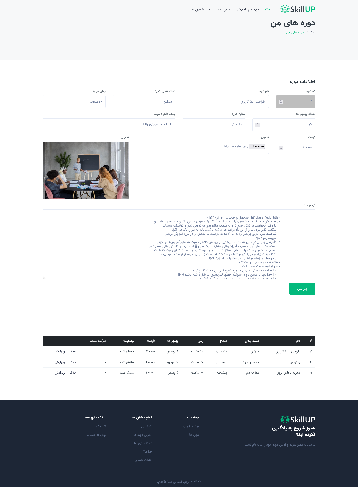

### Skillup is a website with vanilla php for practicing PHP

###### Technologies

- HTML,Css
- jQuery
- Bootstrap grids for responsive
- Slick Slider
- Font Awesome
- PHP

###### What it does

- Has two types of users (admin and public)
- Signup , Login
- Showing courses and their detailes
- Managing courses (add,delete,edit)
- Searching courses
- Managing taken courses

###### Install

Nothing too fancy just import the db and run it on your local srver :)

###### Code Description Video

[Description Video](https://drive.google.com/file/d/1FfZ5n-cCWHkT3Rr8QTgSZN5tzmjmy4bY/view?usp=share_link).

###### Images

Index

Manage-Course-User

